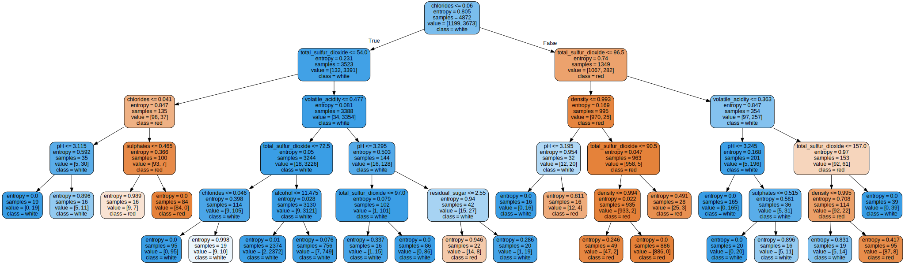

# Artificial Intelligence Scripts

Repositório de scripts de inteligência artificial, que vão desde a comparação de modelos, até mesmo a implementação da metodologia CRISP-DM.

## Wine Analysis

Análise de um dataset de vinhos, com o objetivo de prever o tipo de vinho baseado em suas características. O dataset foi retirado do [dataset wine quality](https://archive.ics.uci.edu/dataset/186/wine+quality) e realiza a comparação dos seguintes classificadores:
1. Arvores de decisão
2. Bayesiano ingenuo
3. Regressão logística
4. K-vizinhos

O projeto possui a execução e explicação de etapas como tratamento dos dados, execução do modelo e visualização de dados que inclui:
- [x] Verificação se existe algum dado faltante e valores constantes
- [x] Verificação da correlação entre as variáveis
- [x] Normalização dos dados através do StandardScaler
- [x] Utilização de uma pontuação de referência
- [x] Busca de hiper parâmetros em cada um dos modelos
- [x] Diminuição da dimensionalidade dos dados através do PCA
- [x] Visualização da fronteira de decisão de um KNN com 2 dimensões
- [x] Visualização de features mais relevantes através de árvore de decisão
- [x] Comparação dos modelos através de uma matriz de confusão
- [x] Comparação dos modelos através da validação cruzada