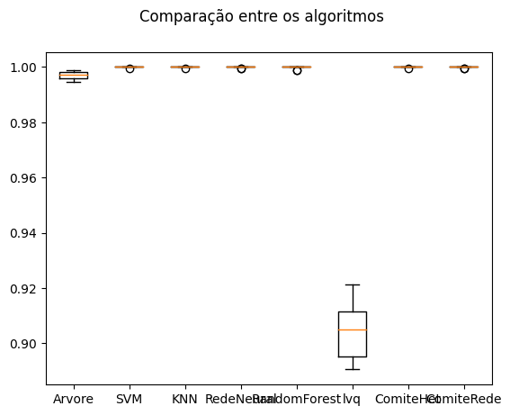

# Artificial Intelligence Scripts

Repositório de scripts de inteligência artificial, que vão desde a comparação de modelos, a implementação da metodologia CRISP-DM e noções de inteligência artificial responsável.

## CRISP-DM

  
  

Implementa a metodologia CRISP-DM para prever se existe um movimento de bando de __boids__. O projeto é ótimo para seleção de features e comparação estatística de modelos. Os seguintes classificadores foram comparados:
1. Arvores de decisão
2. SVM (Support Vector Machine)
3. K-vizinhos
4. MLP (Multi-layer Perceptron)
5. Random Forest
6. LVQ (Learning Vector Quantization)
7. Comitê heterogêneo (Voting Classifier de Decision Tree, SVM e KNN)
8. Comitê homogêneo (MLPs)

## Wine Analysis

Análise de um dataset de vinhos, com o objetivo de prever o tipo de vinho baseado em suas característica, no qual é realiza a comparação dos seguintes classificadores:
1. Arvores de decisão
2. Bayesiano ingenuo
3. Regressão logística
4. K-vizinhos
