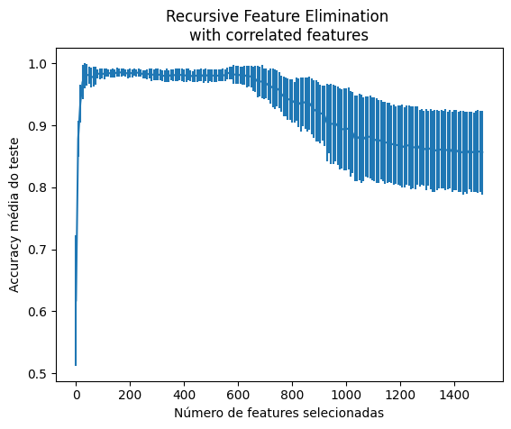

# CRISP-DM

  
  

A partir da metodologia CRISP-DM realiza a previsão do movimento de bando de __boids__ a partir do dataset [Swarm Behavior](https://archive.ics.uci.edu/dataset/524/swarm+behaviour). Todas as etapas da metodologia são realizadas, desde a compreensão do negócio até a avaliação do modelo, passando pela preparação dos dados e modelagem.

É um ótimo exemplo para tratar dados no qual possuem várias features que se repetem, sendo necessário a seleção de determinadas features para acelerar o treinamento e teste, uma vez que cada informação dos boids são dispostas em colunas x1, y1, z1... xN, yN, zN. Neste caso, foi utilizado o SelectKBest, VarianceThreshold e RFECV para a seleção de features.

Para cada um dos modelos, foi realizada uma extensiva busca de hiper parâmetros com validação cruzada, e os resultados foram armazenadas na pasta [hiperparametros](./hiperparametros/). Por fim, os seguintes classificadores foram comparados, se retirando o Kruskal-Wallis e o teste de Tukey:
1. Arvores de decisão
2. SVM (Support Vector Machine)
3. K-vizinhos
4. MLP (Multi-layer Perceptron)
5. Random Forest
6. LVQ (Learning Vector Quantization)
7. Comitê heterogêneo (Voting Classifier de Decision Tree, SVM e KNN)
8. Comitê homogêneo (MLPs)

> O documento de [Relatório](./CRISP-DM_%20Swarm%20Behavior.pdf) explica detalhadamente cada uma das etapas do projeto.
