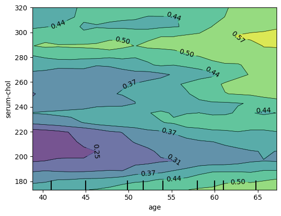
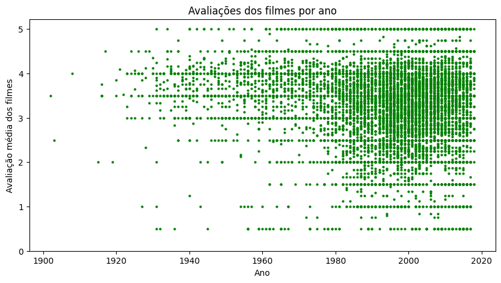

# Responsible AI

  

O [primeiro script](./explainable_ai.ipynb) é uma espécie de documento que explica Explainable AI na prática, detalhando o que é, os seus métodos e como implementá-los. O script utiliza a base de [ataques cardíacos](https://archive.ics.uci.edu/dataset/145/statlog+heart) para explicar os seguintes métodos de interpretabilidade:
1. Global Surrogate
2. Feature Importance
3. Partial Dependence Plot
4. Individual Conditional Expectation
5. Local Surrogate

  

O [segundo script](./recommendation_fairness.ipynb) é a implementação simplificada de um modelo de sistema de recomendação calibrado e um protocolo de decisão para esses sistemas. O script utiliza a base de [movielens](https://grouplens.org/datasets/movielens/) para comparar a justiça de diferentes algoritmos de recomendação. Os seguintes algoritmos foram comparados:
1. User based K Nearest Neighbors (User-KNN)
2. Item based K Nearest Neighbors (Item-KNN)
3. Slope One
4. Non-negate Matrix Factorization
5. Singular Value Decomposition (SVD)
6. Singular Value Decomposition Plus us (SVD++)
8. Co-Clustering

A lógica de um sistema de recomendação calibrado é balancear os itens pelos gêneros, de forma que a recomendação seja justa para todos os usuários, por exemplo, o gênero de Drama é o mais expressivo, de forma que seria o mais recomendado sem uma calibragem. O protocolo da criação de um modelo calibrado é o seguinte:
1. Obtenção do dataset de usuários (pontuação de itens pelos usuários) e itens (mapeamento de gêneros para os itens).
2. Processo de EDA (Exploratory Data Analysis) para entender a distribuição dos gêneros e das pontuações.
3. Divisão do dataset em treino e teste.
4. Obtenção de um modelo de recomendação otimizado pela busca de parâmetros.
5. Criação de uma distribuição de gêneros dos usuários ponderada pela avaliação do usuário e probabilidade do gênero.
6. Obtenção dos itens candidatos para cada usuário a partir da lista de itens não avaliados por eles.
7. Criação da distribuição dos itens candidatos.
8. Seleção dos itens recomendados a partir do algoritmo surrogate_submodular que pode receber diferentes lambdas e funções de utilidade.

A partir dessa lista de itens recomendados para cada um dos usuários, onde o resultado é uma lista para a permutação de cada algoritmo, lambda, funções de utilidade. É necessário escolher qual dos modelos e funções mais se ajusta para o problema, através de um protocolo de decisão:
1. Para cada um dos candidatos obtidos, é calculado o Average Precision, Average Absolute Error e Rank MisCalibration.
2. Obtêm a média dessas métricas para cada uma das variantes, onde o que vai ser agrupado é o resultado dos usuários, assim obtendo o MAP, MACE e MRMC.
3. A partir dessas métricas, extrai o Coefficient of Calibration Error (CCE) e Coefficient of MisCalibration (CMC).
4. Soma os dois e o menor valor é o melhor modelo.